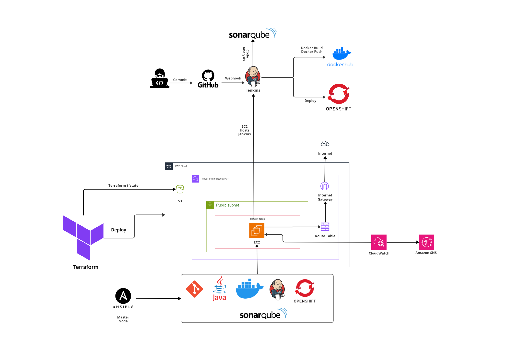
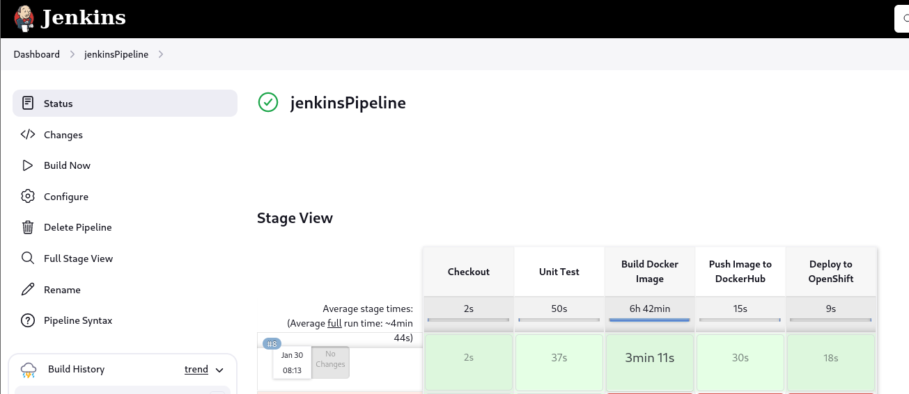

# Project Overview: Automated DevOps Pipeline for a Spring Boot Application

## Introduction

This project seeks to provide a completely automated DevOps pipeline for deploying a Spring Boot application. The project embraces the ideas of Infrastructure as Code (IaC), Continuous Integration (CI), and Continuous Deployment (CD), utilising a range of strong technologies such as Jenkins, OpenShift, Terraform, Ansible, and Docker. The ultimate aim is to have simplified, automated, and fast deployment procedures that include powerful monitoring and alerting capabilities.


## Architecture Overview
<p align="center">
<br><em>Project Architecture</em>
</p>


## Requirements
- :white_circle: GitHub
- :white_circle: AWS 
- :white_circle: Terraform
- :white_circle: Ansible
- :white_circle: Docker
- :white_circle: SonarQube
- :white_circle: Openshift cluster


## Project Structure


### 1. Provisioning AWS Infrastructure Using Terraform

Terraform is used to provide and manage a whole AWS infrastructure, allowing IaC processes and streamlining resource generation while also integrating with CloudWatch for monitoring and alerting.


**Deploying the terraform modules to provision resources:**
* Install AWS CLI and add your AWS user access key and secret access key to enable  

```shell
$ curl "https://awscli.amazonaws.com/awscli-exe-linux-x86_64.zip" -o "awscliv2.zip"
$ unzip awscliv2.zip
$ sudo ./aws/install
$ aws configure
```
### 2. Configuration Using Ansible
Ansible is used to configure AWS EC2 instances for various services like Git, Docker, Java, Jenkins, SonarQube, and OpenShift. Ensuring uniform and repeatable configurations across instances, resulting in fully operational EC2 instances for various DevOps pipeline steps.
1. Create a key pair on AWS. Download it to be used in the dynamic inventory and change its permissions as follows:

```shell
$ chmod 400 finalprojectKey.pem
```
2. Run the ansible playbook using the following command
```shell
$ ansible-playbook -i inventory/aws_ec2.yml playbook.yml
```

### 3. Containerization of the Application

Involves containerizing the Java application, ensuring consistency and ease of deployment through the creation of a Dockerfile detailing dependencies and configurations.

### 4. Using Jenkins for Application Deployment on OpenShift

Jenkins automates Spring Boot application deployment in OpenShift clusters, managing code commit to production deployment efficiently, ensuring a scalable and resilient process.

<p align="center">
<br><em>Jenkins Pipeline Successful Build</em>
</p>

### 5. CI/CD Automation with Jenkins

Jenkins automates the code build, testing, and deployment stages of the CI/CD process, resulting in a smooth, automated pipeline that speeds up the release cycle while reducing manual involvement.

### 6. Centralized Monitoring and Logging with OpenShift

Implement a centralized monitoring system within the OpenShift cluster to boost operational visibility by gathering data on application performance and cluster health.

## Conclusion

The project developed an efficient Spring Boot application deployment system using advanced tools like Jenkins, OpenShift, Terraform, Ansible, and Docker. This system streamlines the deployment process, making it quicker, more reliable, and ensuring consistent performance. The result is a modern, effective solution that meets the demands of fast-paced software development.